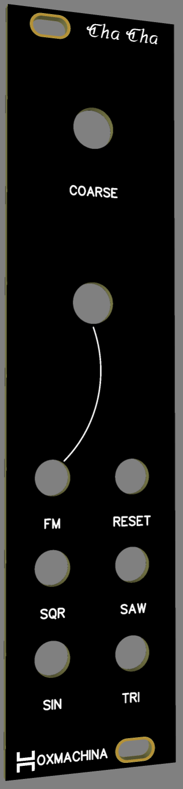

# Cha Cha - VCLFO

Features:

Square core low frequency oscillator with four waveform outputs and two cv inputs for FM, and RESET modulation

Demos: https://www.youtube.com/watch?v=-pCzQHZPQRY&t=0s

## Build Instructions

*Every project shares Gerber files (PCB files), EasyEDA project files (Design files) apart from other kinds of information and instructions, so that you can truly make each module your own, you can change the front panel for example and add your own twist to it, or change the PCB itself and the circuit if you wish so.*

1. Download the Gerber zip files inside the [Gerber Files folder](https://github.com/musicdevghost/eurorack/tree/main/Cha%20Cha%20-%20VCLFO/Gerber%20Files)
2. Browse to your online local PCB manufacturer and upload each zip file one by one, I happen to use https://cart.jlcpcb.com/
    - Don't forget to check the "Remove Order Number" option just for the front panels
    - Please keep in mind that also the frontpanel should be produced in FR4 material when ordering it and not in aluminium (Just use the same material to build the PCBs and Front Panel) since the lightning effect only works with the FR4 material
3. You can easiliy order all needed components from [Tayda](https://www.taydaelectronics.com) online shop simply by uploading the ["Tayda Auto Order"](./Tayda%20Auto%20Order.csv) CSV file at https://www.taydaelectronics.com/quick-order/
4. Print out the BOM file
5. Follow the build instructions video at: https://www.youtube.com/watch?v=DsVzbcYWhuM&t=0s
6. Follow the calibration instructions video at: https://youtu.be/DsVzbcYWhuM

## Developing
If you want to improve on the design and contribute you'll first need to import the project files into your workspace, I used EasyEDA for all my projects, but if you're using something else I believe by now these projects can be imported from a couple of platforms, I use EasyEDA because it's simpler to me, I can just order the PCB directly from the application and it just works (I am by no means sponsored or supported from the company in any way, just sharing what works for me).

You can fork this repository, work on your own improvements, adjustments and hopefuly you would submit a PR for your changes to be merged into this main repository, thus sharing with everyone your updates as well, after of course sharing review of the changes and testing.

You can use [EasyEDA](https://easyeda.com/) to open all project files and import into your own workspace by importing the files located inside the [EasyEDA](https://github.com/musicdevghost/eurorack/tree/main/Cha%20Cha%20-%20VCLFO/EasyEDA) folder, from the application you can make your adjustments, and update the schematics PDF files and Gerber files where available and update the repository with your changes.

## Panel Skeleton Overview

## Specs

* 6HP
* 20mA (+/-12v)

## Disclaimer
All electronic projects and designs shared on this repository, or associated web sites should considered dangerous if not lethal if not used safely. When working on projects based on these designs, use extreme care to ensure that you do not come into contact with mains AC voltages or high voltage DC. If you are not confident about working with mains voltages, or high voltages, or you are not legally allowed to work with mains voltages, or high voltages, you are advised not to attempt work on them. The author, host, and all contributors associated with these repositories disclaim any liability for damages should anyone be killed or injured while working on these projects, or projects based on these designs, or any other project or design presented on these repositories and any associated repositories. The author, host, and all contributors associated with these repositories also disclaim any liability for projects, or projects based on these designs, or any other project or design presented on these repositories and any associated repositories when used in such a way as to infringe relevant government regulations and by-laws. 
